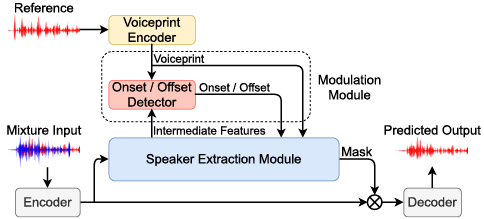
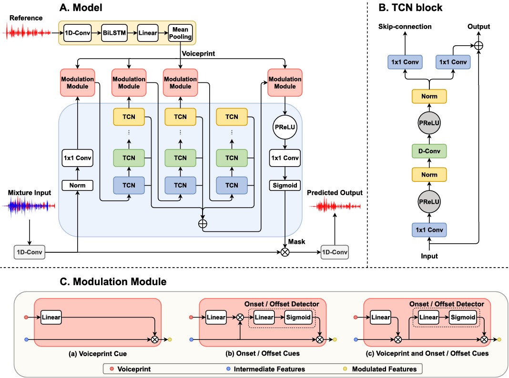
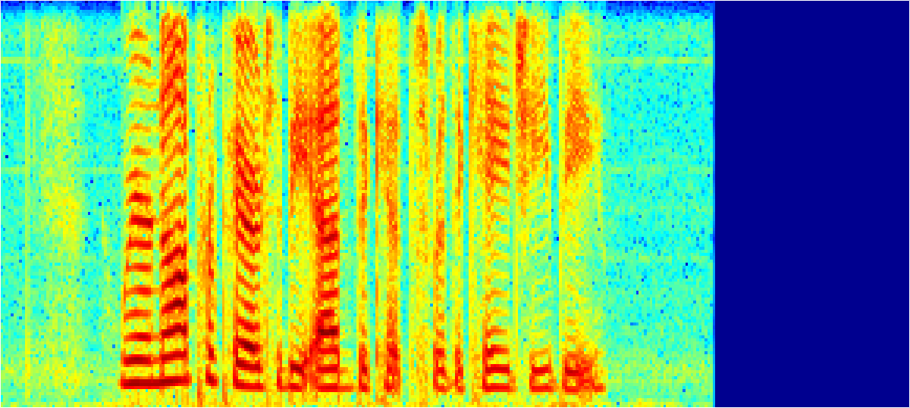
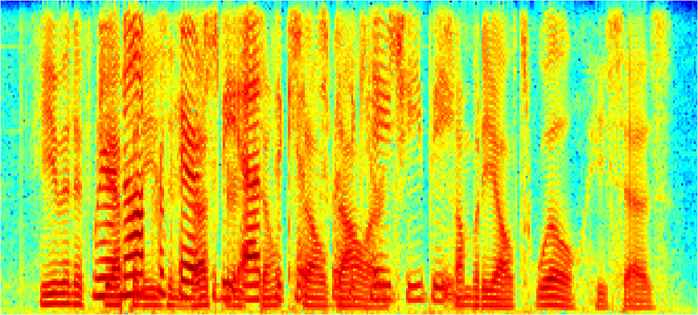
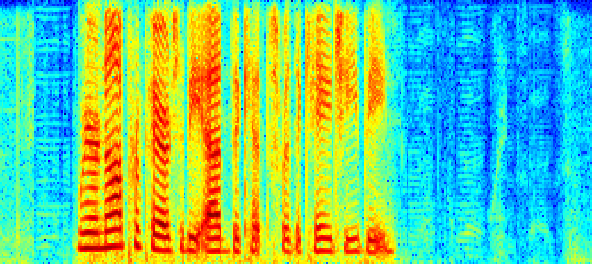
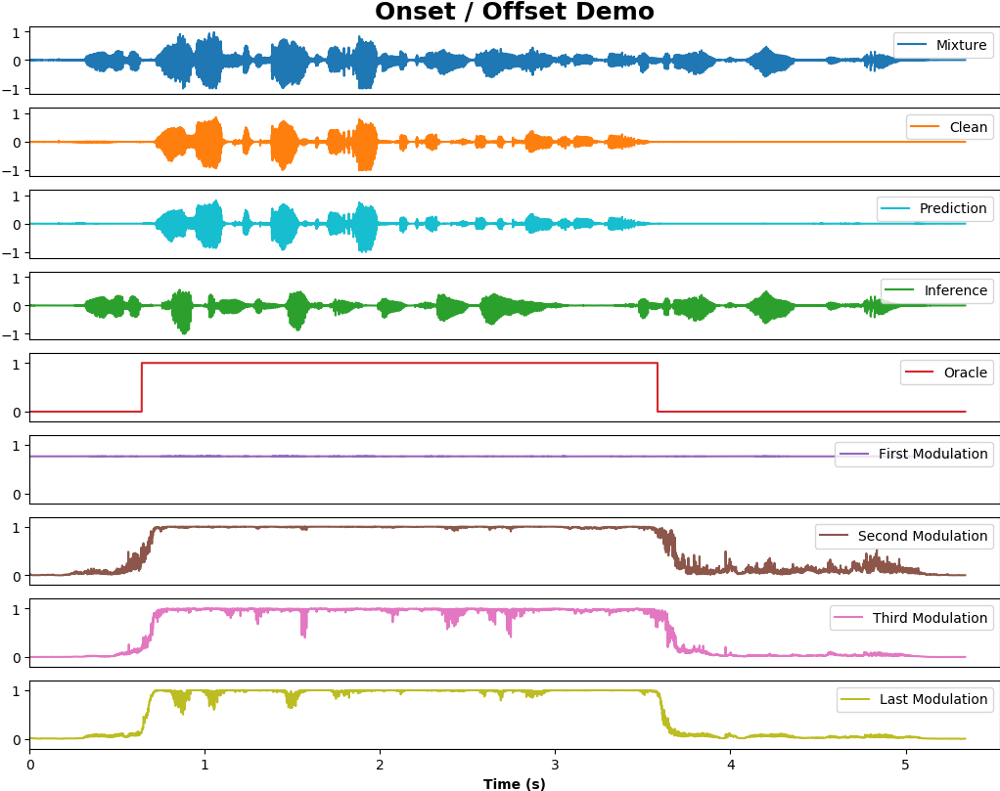

# WASE

## Overview

Demo samples of our paper *Wase: Learning When to Attend for Speaker Extraction in Cocktail Party Environments*. WASE first explicitly models **start/end time of speech** (**onset/offset cues**) in speaker extraction problem.

We will release code soon. If you have any question about implementation details, feel free to ask me (haoyunzhe2017@ia.ac.cn).



## Model

WASE is adapted based on our previous proposed [framework](http://www.interspeech2020.org/uploadfile/pdf/Mon-3-11-6.pdf), which includes five modules: voiceprint encoder, onset/offset detector, speech encoder, speech decoder, and speaker extraction module.

In this work, we focus on the onset/offset cues of speech and verify their effectiveness in speaker extraction task. We also combine the onset/offset cues and voiceprint cue. Onset/offset
cues model start/end time of speech and voiceprint cue models the
voice characteristics. The combination of two perceptual cues bring a significant performance improvement, while extra needed parameters are negligible. Please see the figure below for detailed model structure.


***************************************************************

## Datasets
* [WSJ0](https://catalog.ldc.upenn.edu/LDC93S6A)

The training samples are generated by randomly selecting speeches of different speakers from *si_tr_s* of WSJ0, and mixing them at various signal-to-noise ratios (SNR). The evaluating samples are generated by fixed list *./data/wsj/mix_2_spk_voiceP_tt_WSJ.txt*. 
You may need the command below to modify the evaluating data path.
```bash
sed -i 's/home\/aa/YOUR PATH/g' data/wsj/mix_2_spk_voiceP_tt_WSJ.txt
```

## Result

### Audio Sample

<!-- - Listen to audio sample at webpage: http://swpark.me/voicefilter/ -->
- Listen to audio samples at [*./assets/demo*](./assets/demo).
- Spectrogram samples (clean/mixture/prediction).

<div  align="center">    

<br>

<br>

</div>

- Onset / Offset Visualization.

<div  align="center">    

</div>

This figure contains a lot of information about onset/offset cues.
1. The first modulation is almost straight. We attribute this strange phenomenon to its location near the input, where there is very little processing to mixture speech. This also reminds us that the first modulation position may be too early for onset/offset detection.
2. Except for the first modulation, the other modulation phenomena are in line with expectations. In particular, the last modulation is relatively stable with fewer spikes.
3. The last modulation has slight spikes between the start and the offset. We find that these spikes are consistent with the overlap of clean speech and inference speech. The detector seems to have lower confidence in these places than in other places where there is only clean speech or no clean speech at all.


### Metric

| Methods             | #Params | SDRi(dB) |
| ---------------------- | ----- | ---- |
| [SBF-MTSAL](https://ieeexplore.ieee.org/document/8683874)   |  19.3M  |  7.30 |
| [SBF-MTSAL-Concat](https://ieeexplore.ieee.org/document/8683874)      | 8.9M  | 8.39 |
| [SpEx](https://ieeexplore.ieee.org/document/9067003)      | 10.8M  | 14.6 |
| [SpEx+](https://arxiv.org/abs/2005.04686)      | 13.3M  | 17.2 |
| WASE (onset / offset + voiceprint)      | 7.5M   | 17.05 |


## Citations

If you find this repo helpful, please consider citing:

```
@article{hao2020wase,
  title={Wase: Learning When to Attend for Speaker Extraction
in Cocktail Party Environments},
  author={Hao, Yunzhe and Xu, Jiaming and Zhang, Peng and Xu, Bo}
}
```

```
@article{hao2020unified,
  title={A Unified Framework for Low-Latency Speaker Extraction in Cocktail Party Environments},
  author={Hao, Yunzhe and Xu, Jiaming and Shi, Jing and Zhang, Peng and Qin, Lei and Xu, Bo},
  journal={Proc. Interspeech 2020},
  pages={1431--1435},
  year={2020}
}
```
